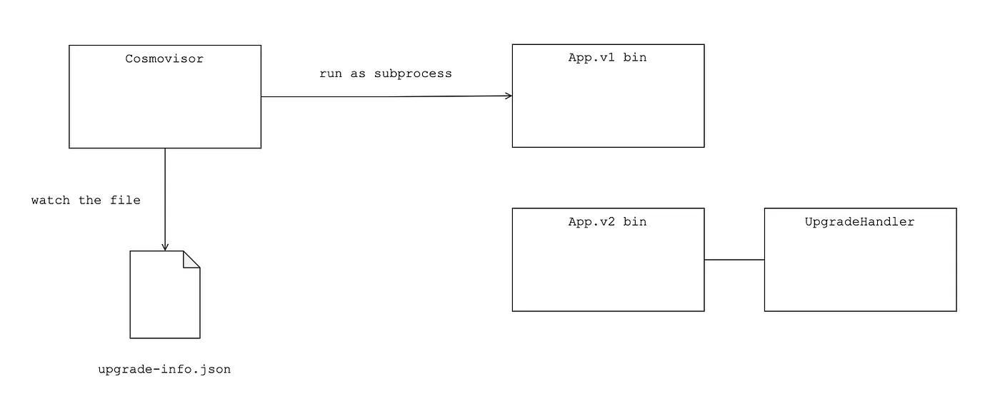
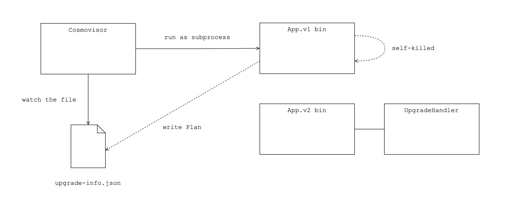
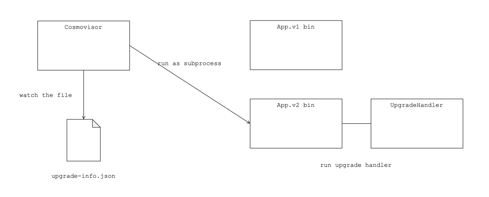
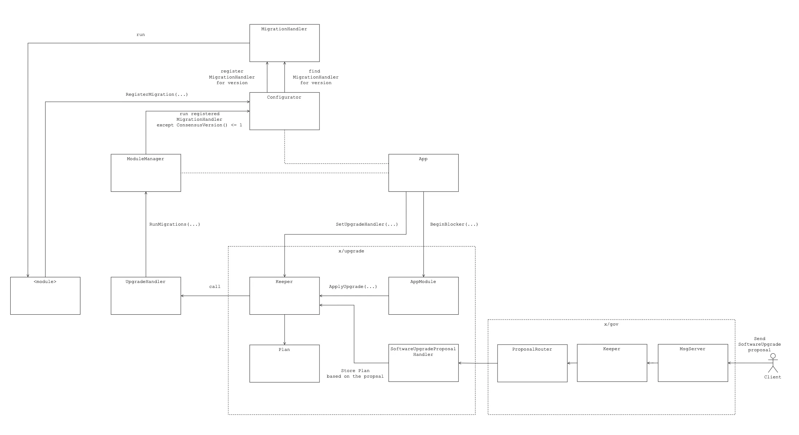
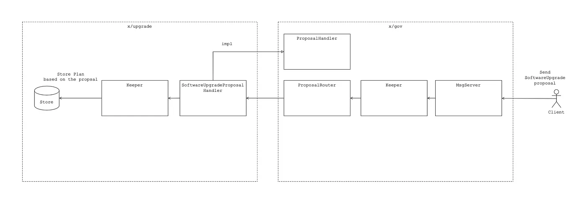

# cosmoshello
**cosmoshello** is a blockchain built using Cosmos SDK and Tendermint and created with [Ignite CLI](https://ignite.com/cli).


## High-Level Design of Blockchain Upgrade Mechanism

Cosmovisor run App.v1 binary and watching upgrade-info.json


If blockchain reaches that height it writes Plan data as a file into upgrade-info.json and killed itself


Cosmovisor re-run the application binary on the symbolic link



Upgrade From ‘Application’ Point of View
Let’s take a look from the Application point of view. There’re lots of components that work together to make In-Store Migration correctly.

The client can send the SoftwareUpgrade proposal to the x/gov module MsgServer. After the proposal is passed, the content of the proposal is routed to the x/upgrade module SoftwareUpgradeHandler and is saved as Plan data in the x/upgrade module state.
Every time the block is created, x/upgrade ‘s BeginBlocker checks whether it’s time to upgrade by block height. If it’s time, the old version application is panic and the new version of the application is run by Cosmovisor.
After the new version of the application is run, x/upgrade module runs the registered UpgradeHandler and UpgradeHandler runs the ModuleManager RunMigrations(…) method which calls each module’s MigrationHandler if needed. So for the module to be updated successfully, MigrationHandler must be registered on the new version of the application.



### x/gov
What x/gov mainly done for the upgrade is to receive the SoftwareUpgrade proposal and after the proposal is passed, send proposal content to the x/upgrade module to make it do subsequent jobs for the upgrade.



### x/upgrade
x/gov module helps x/upgrade to know the Plan of software upgrade: when (block height) and what (the name of version). But still don’t know how to upgrade for each module. An application consists of modules. Each module functionality makes up the whole functionalities of the application. Upgrading an application (i.e. chain) usually means upgrading some modules. There might be some bugs, improvements, or adjustments to parameters.


## Get started

```
ignite chain serve
```

`serve` command installs dependencies, builds, initializes, and starts your blockchain in development.

### Configure

Your blockchain in development can be configured with `config.yml`. To learn more, see the [Ignite CLI docs](https://docs.ignite.com).

### Web Frontend

Additionally, Ignite CLI offers both Vue and React options for frontend scaffolding:

For a Vue frontend, use: `ignite scaffold vue`
For a React frontend, use: `ignite scaffold react`
These commands can be run within your scaffolded blockchain project. 


For more information see the [monorepo for Ignite front-end development](https://github.com/ignite/web).

## Release
To release a new version of your blockchain, create and push a new tag with `v` prefix. A new draft release with the configured targets will be created.

```
git tag v0.1
git push origin v0.1
```

After a draft release is created, make your final changes from the release page and publish it.

### Install
To install the latest version of your blockchain node's binary, execute the following command on your machine:

```
curl https://get.ignite.com/username/cosmoshello@latest! | sudo bash
```
`username/cosmoshello` should match the `username` and `repo_name` of the Github repository to which the source code was pushed. Learn more about [the install process](https://github.com/allinbits/starport-installer).

## Learn more

- [Ignite CLI](https://ignite.com/cli)
- [Tutorials](https://docs.ignite.com/guide)
- [Ignite CLI docs](https://docs.ignite.com)
- [Cosmos SDK docs](https://docs.cosmos.network)
- [Developer Chat](https://discord.gg/ignite)
